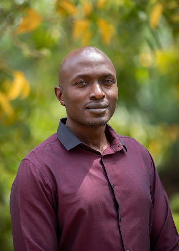
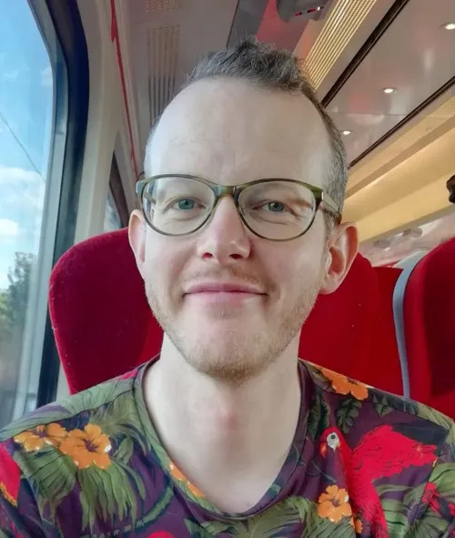
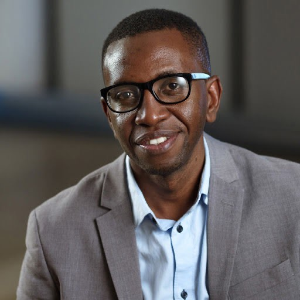

# AI for African languages conference 2026
{: .fs-9 }

Unlock the power of East African languages: Innovate, connect, and build inclusive language technology for tomorrow.
{: .fs-6 .fw-300 }

---

The field of Natural Language Processing (NLP) has made remarkable strides, yet a significant disparity persists in the resources available for different languages. African languages, in particular, are largely underrepresented in NLP research and development, leading to a critical "low-resource" challenge. This workshop aims to address this gap by bringing together NLP researchers, practitioners, and companies from across Africa, with a strong focus on the vibrant East African region. Our goal is to foster collaboration, share cutting-edge research, and showcase practical applications of NLP for African languages, ultimately accelerating the development of robust and inclusive language technologies.

# Call for Submissions

We are looking for submissions that present original research, practical deployments, and innovative ideas addressing the unique challenges and opportunities in low-resource language technology, specifically for African languages. We encourage contributions that explore theoretical advancements, methodological innovations, empirical studies, and real-world applications.

This workshop is meant to be inter-disciplinary, merging industry and research. We believe that bridging the gap between academic exploration and industrial implementation is crucial for impactful progress in low-resource language technology. We encourage submissions that showcase collaborative efforts and demonstrate the potential for NLP to solve real-world problems in African contexts.

## We invite two forms of submissions:

1. **Research Track:** Submissions must be **at least 5 pages** (excluding references and supplementary material) presenting theoretical, methodological, technical, exploratory, or empirical work relevant to the themes of this workshop. These will be presented as short lightning talks during dedicated paper panels, followed by interactive discussion and Q&A.
2. **Industry Track:** Submissions must be **at least 5 pages** (excluding references and supplementary material) describing deployed NLP solutions, case studies of real-world implementations, or practical challenges and lessons learned from developing and deploying language technologies for African languages in industry settings.

Submissions must strictly adhere to the **[LaTeX style guide and template](https://www.overleaf.com/latex/templates/jmlr-template/zqvxjzpbgxvb)**. Submissions that do not conform to this template will be **automatically disqualified without review**.

**You can submit for both tracks using [OpenReview](https://openreview.net/group?id=AfriLang_AI/2026/Conference) by 2nd October, 2026 AoE.**

> **Note:**  
> According to OpenReview's moderation policy for newly created profiles in the Call for Papers:
>
> - New profiles **without an institutional email** will go through a moderation process that can take up to **two weeks**.
> - New profiles **with an institutional email** will be **activated automatically**.
>
> Please keep this in mind when creating your OpenReview profile for submissions.

## Timelines

* **Deadline for submissions:** October 2nd, 2026 AoE
* **Acceptance notification:** November 10th, 2026
* **Workshop date:** December 10th, 2026

## Venue

**Makerere University**  
8HM9+3C Kampala, Uganda.  
[View on Google Maps](https://maps.app.goo.gl/nVvov2JioBrEGUHF8)

## Workshop scope and topics

Themes for submissions can include but are not limited to:

1. **Data Collection and Annotation for Low-Resource African Languages:** Novel approaches to creating, augmenting, and curating datasets for machine translation, speech recognition, text-to-speech, and other NLP tasks in resource-scarce settings.
2. **Cross-Lingual Transfer Learning and Multilingual Models:** Techniques for leveraging high-resource languages to improve performance on low-resource African languages, including pre-training, fine-tuning, and multilingual model architectures.
3. **African Language Speech Technologies:** Advancements in automatic speech recognition (ASR), speech synthesis (TTS), and speaker recognition for diverse African languages and accents.
4. **Machine Translation for African Languages:** Innovations in neural machine translation (NMT) and other approaches to bridge the communication gap between African languages and global languages.
5. **Ethical Considerations and Bias in African Language Technologies:** Discussions on fairness, accountability, transparency, and the potential for bias in NLP models applied to African linguistic and cultural contexts.
6. **Applications of NLP for Societal Impact in Africa:** Real-world deployments of NLP solutions in areas such as education, healthcare, agriculture, financial inclusion, and cultural preservation.
7. **Computational Linguistics of African Languages:** Linguistic analysis, phonology, morphology, syntax, and semantics of African languages relevant to NLP model development.
8. **Tools and Resources for African Language NLP:** Development of open-source libraries, frameworks, evaluation benchmarks, and other resources to facilitate research and development.
9. **Multilingual LLMs for Enhanced Language Comprehension and Task Flexibility:** Research and development into leveraging large-scale pre-trained models (LLMs) for African languages, including improving contextual understanding, zero-shot and few-shot learning, and multilingual capabilities and code-switching.

## Reviewing

Papers will be peer reviewed by at least 3 Programme Committee members and selected for:

* Disciplinary depth
* Novelty of perspectives
* Ability to foster cross-disciplinary dialog
* Relevance to low-resource African language technology
* Potential for impact and community building

## Publication

Accepted submissions will be published online in **[PMLR](https://proceedings.mlr.press/)** and shared on the workshop website (unless requested otherwise by the authors). Authors of accepted papers will be invited to present their work as lightning talks during dedicated paper panels, followed by interactive Q&A and discussion sessions. Accepted papers will be asked to be revised to at least 5 pages for publication.

_Proceedings from our 2025 edition are available in **[PMLR Volume 314](https://proceedings.mlr.press/v314/)**._

---

## Organizing Committee

### General Chair

  
  

    <strong>Dr. Ernest Mwebaze</strong> 
    <em>Executive Director, Sunbird AI</em>  
    Dr. Ernest Mwebaze is the Executive Director of Sunbird AI, a non-profit that develops practical AI research and products for social impact with a focus on Africa. He has over a decade of experience teaching and researching at Makerere University, where he co-founded its Artificial Intelligence Lab. He has worked as a research scientist at Google AI in Ghana and at the UN Pulse Lab in Kampala, applying AI to tackle development challenges in agriculture, utilities, the SDGs, and African language technologies. He holds a PhD in Machine Learning from the University of Groningen, The Netherlands.
  

### Program Committee Chairs

  
  

    <strong>Dr. John Quinn</strong> 
    <em>Director, Sunbird AI</em>  
    John Quinn is the Director of Research at Sunbird AI in Uganda. He has previously been a Staff Research Software Engineer at Google, where he started the Open Buildings project to map three continents using satellite imagery and computer vision, was technical lead for Africa projects at United Nations Global Pulse, and Senior Lecturer in Computer Science at Makerere University in Uganda. He has worked on a number of large scale AI projects across the African continent, in the fields of remote sensing, speech and language, agriculture and health. He holds a BA in computer science from the University of Cambridge (2000), and a PhD in machine learning from the University of Edinburgh (2007).
  

### Program Committee & Publications Chair

  
  

    <strong>Prof. Engineer Bainomugisha</strong> 
    <em>Professor & Chair, Department of Computer Science, Makerere University</em>  
    Prof. Engineer Bainomugisha is a Professor and the Chair of Computer Science at Makerere University, Uganda. His research interests span programming language engineering, distributed and cloud systems, low-cost sensor technologies and applications of AI for social impact. His pioneering work includes AirQo, Africa's largest air quality monitoring and modelling system. He serves as a founding board member of Sunbird AI, championing AI for public good. He holds a PhD in Computer Science from Vrije Universiteit Brussel, Belgium.
  

### Program Committee

  

    <strong>Engineer Bainomugisha</strong>, Makerere University, Uganda
  

  

    <strong>Ernest Mwebaze</strong>, Sunbird AI, Uganda
  

  

    <strong>John Quinn</strong>, Sunbird AI, Uganda
  

  

    <strong>Joel Tibabwetiza Muhanguzi</strong>, Sunbird AI, Uganda
  

  

    <strong>Janat Namara</strong>, Sunbird AI, Uganda
  

