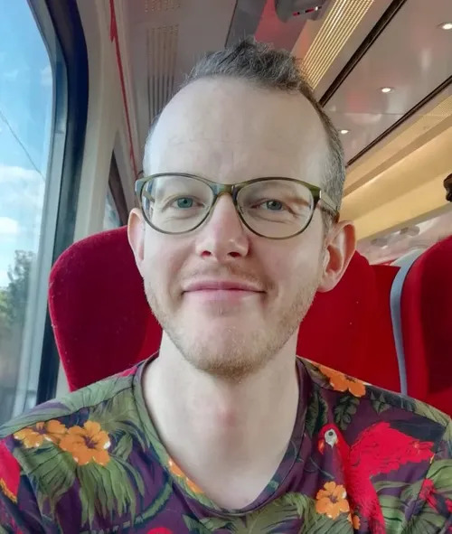

# AI for African languages conference 2025
{: .fs-9 }

Unlock the power of East African languages: Innovate, connect, and build inclusive language technology for tomorrow.
{: .fs-6 .fw-300 }
---

The field of Natural Language Processing (NLP) has made remarkable strides, yet a significant disparity persists in the resources available for different languages. African languages, in particular, are largely underrepresented in NLP research and development, leading to a critical "low-resource" challenge. This workshop aims to address this gap by bringing together NLP researchers, practitioners, and companies from across Africa, with a strong focus on the vibrant East African region. Our goal is to foster collaboration, share cutting-edge research, and showcase practical applications of NLP for African languages, ultimately accelerating the development of robust and inclusive language technologies.

# Call for Submissions

We are looking for submissions that present original research, practical deployments, and innovative ideas addressing the unique challenges and opportunities in low-resource language technology, specifically for African languages. We encourage contributions that explore theoretical advancements, methodological innovations, empirical studies, and real-world applications.

This workshop is meant to be inter-disciplinary, merging industry and research. We believe that bridging the gap between academic exploration and industrial implementation is crucial for impactful progress in low-resource language technology. We encourage submissions that showcase collaborative efforts and demonstrate the potential for NLP to solve real-world problems in African contexts.

## We invite two forms of submissions:

1.  **Research Track:** 2-4 page papers that are a theoretical, methodological, technical, exploratory, or empirical exploration of the themes of this workshop. These will be presented as short lightning talks during the paper panels in the workshop. You will have a chance to get feedback on these papers through post-panel discussion and Q\&A.
2.  **Industry Track:** 1-2 page papers describing deployed solutions of NLP, case studies of successful implementations, or challenges and lessons learned from developing and deploying language technologies for African languages in industry settings.

Submissions should follow this [LaTeX style guide](https://www.overleaf.com/latex/templates/template-for-submissions-to-ceur-workshop-proceedings-ceur-ws-dot-org/wqyfdgftmcfw).

**You can submit for both tracks using [OpenReview](https://openreview.net/group?id=AfriLang_AI/2025/Conference) by September 3rd, 2025 AoE.** 
> **Note:**  
> According to OpenReview's moderation policy for newly created profiles in the Call for Papers:
>
> - New profiles **without an institutional email** will go through a moderation process that can take up to **two weeks**.
> - New profiles **with an institutional email** will be **activated automatically**.
>
> Please keep this in mind when creating your OpenReview profile for submissions.

## Timelines:

Extended Deadline for submissions: September 3rd, 2025 AoE

Acceptance notification: September 29th, 2025

Workshop date: October 10, 2025

## Venue:

**Four Points by Sheraton, Kampala, Uganda**  
Plot No. 1 Elgon Terrace Kampala, 117516.

[View on Google Maps](https://maps.app.goo.gl/CG2nhqYJWzxRwaib6)

## Workshop scope and topics:

Themes for submissions can include but are not limited to:

1.  **Data Collection and Annotation for Low-Resource African Languages:** Novel approaches to creating, augmenting, and curating datasets for machine translation, speech recognition, text-to-speech, and other NLP tasks in resource-scarce settings.
2.  **Cross-Lingual Transfer Learning and Multilingual Models:** Techniques for leveraging high-resource languages to improve performance on low-resource African languages, including pre-training, fine-tuning, and multilingual model architectures.
3.  **African Language Speech Technologies:** Advancements in automatic speech recognition (ASR), speech synthesis (TTS), and speaker recognition for diverse African languages and accents.
4.  **Machine Translation for African Languages:** Innovations in neural machine translation (NMT) and other approaches to bridge the communication gap between African languages and global languages.
5.  **Ethical Considerations and Bias in African Language Technologies:** Discussions on fairness, accountability, transparency, and the potential for bias in NLP models applied to African linguistic and cultural contexts.
6.  **Applications of NLP for Societal Impact in Africa:** Real-world deployments of NLP solutions in areas such as education, healthcare, agriculture, financial inclusion, and cultural preservation.
7.  **Computational Linguistics of African Languages:** Linguistic analysis, phonology, morphology, syntax, and semantics of African languages relevant to NLP model development.
8.  **Tools and Resources for African Language NLP:** Development of open-source libraries, frameworks, evaluation benchmarks, and other resources to facilitate research and development.
9. **Large Language Models (LLMs) for Enhanced Language Comprehension and Task Flexibility:** Research and development into leveraging large-scale pre-trained models (LLMs) for African languages, including: improving contextual understanding, zero-shot and few-shot Learning, and multilingual capabilities and code-Switching.

## Reviewing:

Papers will be reviewed by workshop organizers and selected for:

  - Disciplinary depth
  - Novelty of perspectives
  - Ability to foster cross-disciplinary dialog
  - Relevance to low-resource African language technology
  - Potential for impact and community building

## Publication and Presentation Format:

Accepted submissions will be published online in [CEUR proceedings](https://ceur-ws.org/) and will also be shared on the workshop website (unless requested otherwise by the authors). Authors of accepted papers will be invited to present their work as lightning talks during dedicated paper panels, followed by interactive Q&A and discussion sessions.
## Organizing Committee

### General Chair

  
  

    <strong>Dr. Ernest Mwebaze</strong> 
    Executive Director, Sunbird AI  
    Dr. Ernest Mwebaze is the Executive Director of Sunbird AI, a non-profit AI that develops practical AI research and products for social impact with a focus on Africa. He has over a decade of experience teaching and researching at Makerere University, where he co-founded its Artificial Intelligence Lab. He has worked as a research scientist at Google AI in Ghana and at the UN Pulse Lab in Kampala, applying AI to tackle development challenges in agriculture, utilities, the SDGs, and African language technologies. He holds a PhD in Machine Learning from the University of Groningen, The Netherlands.
  

### Co-Chairs

  
  

    <strong>Dr. Richard Kimera</strong> 
    Lecturer, Department of Information Technology, Mbarara University of Science and Technology (MUST)  
    Dr. Richard Kimera is a Lecturer at Mbarara University of Science and Technology. He holds a PhD in Engineering (ICT Convergence) from Handong Global University in South Korea. His research focuses on Natural Language Processing (NLP), Deep Learning, and Neural Machine Translation, particularly for low-resource languages such as Luganda. He developed a parallel English–Luganda corpus that enabled the first publicly available neural machine translation model for this language pair. Dr. Kimera is also affiliated with Handong Global University and actively contributes to international AI research collaborations.
  

  
  

    <strong>Dr. Joyce Nakatumba-Nabende</strong> 
    Senior Lecturer, Department of Computer Science, Makerere University  
    Dr. Joyce Nakatumba-Nabende is a Senior Lecturer in the Department of Computer Science and Head of the AI Lab at Makerere University. Her research interests and experience include Artificial Intelligence, Machine Learning, Natural Language Processing, and Responsible AI and their applications in health and agriculture. She is also a key contributor to regional AI capacity building initiatives and interdisciplinary AI research in East Africa. She holds a PhD in Computer Science from Eindhoven University of Technology (The Netherlands).
  

### Program Committee Chairs

  
  

    <strong>Dr. Andrew Katumba</strong>
    Lecturer, Department of Electrical and Computer Engineering, Makerere University
      
    Dr. Andrew Katumba holds a PhD in Photonics Engineering from Ghent University, Belgium and an MSc in Optics and Photonics from Karlsruhe Institute of Technology (Germany). He leads the Marconi Research and Innovation Lab at Makerere University and conducts research applying AI to healthcare in low-resource environments, including cancer screening using medical imaging technologies like ultrasound and MRI. He also champions the digitization of healthcare workflows and plays a leading role in Uganda’s national cancer Health Information Exchange initiative.
  

  
  

    <strong>Dr. John Quinn</strong>
    Director, Sunbird AI
      
    John Quinn is the Director of Research at Sunbird AI in Uganda. He has previously been a Staff Research Software Engineer at Google, where he started the Open Buildings project to map three continents using satellite imagery and computer vision, was technical lead for Africa projects at United Nations Global Pulse, and Senior Lecturer in Computer Science at Makerere University in Uganda. He has worked on a number of large scale AI projects across the African continent, in the fields of remote sensing, speech and language, agriculture and health. He holds a BA in computer science from the University of Cambridge (2000), and a PhD in machine learning from the University of Edinburgh (2007).
  

### Program Committee & Publications Chair

  
  

    <strong>Prof. Engineer Bainomugisha</strong> 
    Professor & Chair, Department of Computer Science, Makerere University  
    Prof. Engineer Bainomugisha is a Professor and the Chair of Computer Science at Makerere University, Uganda. His research interests span programming language engineering, distributed and cloud systems, low-cost sensor technologies and applications of AI for social impact. His pioneering work includes AirQo, Africa's largest air quality monitoring and modelling system. He serves as a founding board member of Sunbird AI, championing AI for public good. He holds a PhD in Computer Science from Vrije Universiteit Brussel, Belgium.
  

### Program Committee
<!-- Additional Program Committee Members -->

  

    <strong>Happy Buzaaba</strong>, Princeton University, USA
  

  

    <strong>Peter Nabende</strong>, Makerere University, Uganda
  

  

    <strong>Dina Machuve</strong>, DevData Analytics, Tanzania
  

  

    <strong>Zewdie Mossie Erukneh</strong>, Debre Markos University, Ethiopia
  

  

    <strong>David SABIITI Bamutura</strong>, Mbarara University of Science and Technology, Uganda
  

  

    <strong>Engineer Bainomugisha</strong>, Makerere University, Uganda
  

  

    <strong>Ernest Mwebaze</strong>, Sunbird AI, Uganda
  

  

    <strong>Joyce Nakatumba Nabende</strong>, Makerere University, Uganda
  

  

    <strong>Andrew Katumba</strong>, Makerere University, Uganda
  

  

    <strong>Richard Kimera</strong>, Mbarara University of Science and Technology, Uganda
  

  

    <strong>John Quinn</strong>, Sunbird AI, Uganda
  

  

    <strong>Lilian D. Awuor Wanzare</strong>, Maseno University, Kenya
  

## AfriLang AI 2025 Accepted Papers

| Number | Title | Decision |
|--------|-------|----------|
| **1** | Sauti Halisi: Towards Direct Speech-to-Text Translation for Colloquial and Code-Switched Swahili | Accept (Oral) |
| **3** | Promoting Uganda’s major local languages: Introducing Luganda Text generation models and diverse accent-aware TTS models | Accept (Oral) |
| **5** | End-to-End Continuous Ethiopia Sign Language Recognition | Accept (Oral) |
| **6** | Tonative: Community-Driven Extension of African Datasets Through Human-AI Collaboration | Accept (Oral) |
| **8** | Bridging the Language Gap: Fine-Tuning Llama for Machine Translation in Low-Resource African Languages | Accept (Oral) |
| **9** | KALAM-NA: Multi-Dialectal Corpus for 16 variants of the Sara linguistic family of Chad | Accept (Oral) |
| **11** | How much speech data is necessary for ASR in African languages? An evaluation of data scaling in Kinyarwanda and Kikuyu | Accept (Oral) |
| **12** | Robust Tokenization for Low-Resource Oromo Medical Texts via Novel Lightweight Augmentation | Accept (Oral) |
